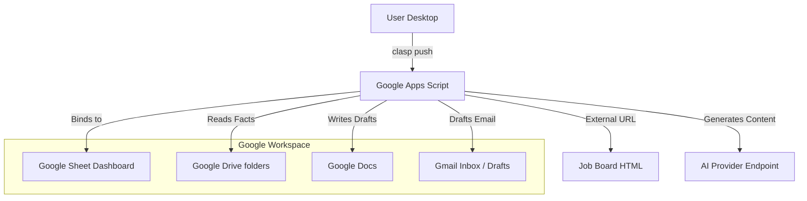

# 02: Architecture

## Repository and Apps Script

The system lives across a local GitHub repository pushing to a single Google Apps Script backend that operates over a Google Sheet.

### Diagram

## System Internals

1. **Ingestion (`src/intake.gs`, `src/jobs.gs`)**: Handles HTTP fetching from Job boards and pasting raw descriptions. Deduplicates using URL normalization and an auto-generated `dedupe_key`.
2. **Scoring (`src/Scoring.ts`)**: (When enabled) analyzes fit based on `role families` and `keywords`. 
3. **Draft Generation (`src/ai.gs`, `src/docs.gs`)**: Invokes AI endpoints, loading constraints and the facts directory. Outputs structured JSON that replaces variables in template Docs and Gmail drafts.
4. **Task Management (`src/tasks.gs`)**: Tracks follow-ups and action items logically connected to `job_id`.
5. **Reconciliation & Integrity (`src/reconciliation.gs`, `src/integrity.gs`)**: Periodically checks schema constraints, cleans up stale data, and ensures the SSOT matches the expected shape.

## Data Storage
The Google Sheet contains the following core tabs:
- **SETTINGS**: System-wide configuration.
- **JOBS**: Opportunities and their current status tracking.
- **TASKS**: Actionable individual items.
- **RESEARCH**: Output notes (decision briefs) about specific roles or companies.
- **INTERACTIONS**: Auto-scanned inbound emails and user networking touchpoints.
